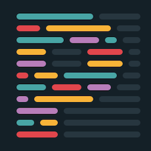

# Modernizing Your Dev Workflow

Using Nx, you can add Cypress, Jest, Prettier, and Nest into your dev workflow.

Of course, it's not the case that Cypress is always better than Protractor or Nest is always better than say Express. There are tradeoffs. But in many situations, for many projects, these innovative tools offer a lot of advantages.

Adding these tools to the dev workflow is challenging in a regular CLI project. The choice you have is not between Protractor or Cypress, but between a hacked-up setup for Cypress and a great CLI setup for Protractor. Nx changes that!

## Nest


Nest is a Node.js framework designed for building scalable server-side applications. In many ways, Nest is familiar to Angular developers:

- It has excellent TypeScript support.
- Its dependency injection system is similar to the one in Angular.
- It emphasises testability.
- Its configuration APIs are similar to Angular as well.

Many conventions and best practices used in Angular applications can be also be used in Nest.

To create a new Nest application, run:

```bash
ng g node-application api # you can also be explicit and pass `--framework=nestjs`
```

This will create the following:

```treeview
<workspace name>/
├── apps/
│   └── api/
│       ├── jest.conf.js
│       ├── proxy.conf.json
│       ├── src/
│       │   ├── app/
│       │   │   ├── app.controller.ts
│       │   │   ├── app.controller.spec.ts
│       │   │   ├── app.module.ts
│       │   │   ├── app.service.ts
│       │   │   └── app.service.spec.ts
│       │   ├── assets/
│       │   ├── environments/
│       │   │   ├── environment.ts
│       │   │   └── environment.prod.ts
│       │   └── main.ts
│       ├── tsconfig.app.json
│       ├── tsconfig.json
│       ├── tsconfig.spec.json
│       └── tslint.json
├── libs/
├── nx.json
├── package.json
├── tools/
├── tsconfig.json
└── tslint.json
```

You can run:

- `ng serve api` to serve the application
- `ng build api` to build the application
- `ng test api` to test the application

Adding a Nest app will also add Nest schematics to the workspace, which you can run as follows:

```bash
ng generate @nestjs/schematics:controller mycontroller --sourceRoot=apps/nestapp/src --path=app
```

The best way to discover what schematics Nest provides is by using Angular Console:

SCREENSHOT

Read more about Nest at [nestjs.com](https://nestjs.com).

### Using Express

To create an express application, run `ng g node-application api --framework=express`.

### Using Other Framework

To create an empty node application, run `ng g node-application api --framework=none`.

## Cypress


Cypress is an e2e test runner built for modern web. It has a lot of great features:

- Time travel
- Real time reloads
- Automatic waiting
- Spies, stubs, and clocks
- Network traffic control
- Screenshots and videos

By default, when creating a new Angular application, Nx will use Cypress to create the e2e tests project.

So running `ng g application frontend` will create:

```treeview
<workspace name>/
├── README.md
├── angular.json
├── apps/
│   ├── frontend/
│   └── frontend-e2e/
│       ├── cypress.json
│       ├── src/
│       │   ├── fixtures/
│       │   │   └── example.json
│       │   ├── integration/
│       │   │   └── app.spec.ts
│       │   ├── plugins/
│       │   │   └── index.ts
│       │   └── support/
│       │       ├── app.po.ts
│       │       ├── commands.ts
│       │       └── index.ts
│       ├── tsconfig.e2e.json
│       ├── tsconfig.json
│       └── tslint.json
├── libs/
├── nx.json
├── package.json
├── tools/
├── tsconfig.json
└── tslint.json
```

You can run:

- `ng e2e frontend-e2e` to run e2e tests
- `ng e2e frontend-e2e --watch` to run e2e tests in the watch mode
- `ng e2e frontend-e2e --headless` to run e2e tests in the headless mode (used in CI)

Read more about Cypress at [cypress.io](https://cypress.io).

### Using Protractor

To use Protractor instead of Cypress, run `ng g application frontend --e2e-test-runner=protractor`.

## Jest


Jest is a fast 0-setup testing framework from Facebook.

By default, Nx uses Jest for both Angular and Node.js applications. So if you run `ng g application frontend`, you will get:

```treeview
<workspace name>/
├── README.md
├── angular.json
├── apps/
│   ├── frontend/
│   │   ├── browserslist
│   │   ├── jest.conf.js
│   │   ├── src/
│   │   │   ├── app/
│   │   │   ├── assets/
│   │   │   ├── environments/
│   │   │   ├── favicon.ico
│   │   │   ├── index.html
│   │   │   ├── main.ts
│   │   │   ├── polyfills.ts
│   │   │   ├── styles.scss
│   │   │   └── test.ts
│   │   ├── tsconfig.app.json
│   │   ├── tsconfig.json
│   │   ├── tsconfig.spec.json
│   │   └── tslint.json
│   └── frontend-e2e/
├── libs/
├── nx.json
├── package-lock.json
├── package.json
├── tools/
├── tsconfig.json
└── tslint.json
```

Read more about Jest at [jestjs.io](https://jestjs.io).

### Using Karma

To use Karma instead of Jest, run `ng g application frontend --unit-test-runner=karma`.

## Prettier



Prettier is an opinionated code formatter. An Nx workspace comes with Prettier preconfigured.

```treeview
<workspace name>/
├── README.md
├── angular.json
├── apps/
├── libs/
├── nx.json
├── package-lock.json
├── package.json
├── tools/
├── .prettierrc # prettier config
├── tsconfig.json
└── tslint.json
```

You can run:

- `yarn format:write` to format the files
- `yarn format:check` to check the formatted files
