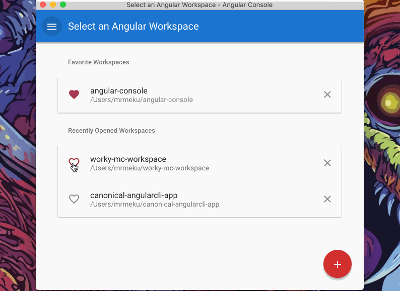

# Getting Started

<iframe src="https://player.vimeo.com/video/237418773" width="100%" height="360" frameborder="0" allowfullscreen></iframe>

## Installing Nx

Nx is just a set of power-ups for Angular CLI, **so an Nx workspace is an Angular CLI workspace**. This means that it will be handy to have the Angular CLI installed globally, which can be done via npm or yarn as well.

```bash
npm install -g @angular/cli
```

or

```bash
yarn global add @angular/cli
```

> Note: If you do not have the Angular CLI installed globally you may not be able to use ng from the terminal to run CLI commands within the project. But the `package.json` file comes with npm scripts to run ng commands, so you can run npm start to ng serve and you can run `npm run ng <command>` to run any of the ng commands.

After you have installed the Angular CLI, install `@nrwl/schematics`.

```bash
npm install -g @nrwl/schematics
```

or

```bash
yarn global add @nrwl/schematics
```

> If you want to work with the version still in development you can use `@nrwl/schematics@next` as the package to install.


## Nx Workspace 

### Creating an Nx Workspace

To create an Nx workspace, run: 

```bash
ng new myworkspace --collection=@nrw/schematics
```

The `ng new` command uses globally-installed packages. Anything installed globally can be in a messy state. If you have any problems running the command above, you can also run:

```bash
create-nx-workspace myworkspacename
```

This command still runs `ng new` under the hood, but it does it in a sandboxed environment, and, as a result, never fails.


### Adding to an Existing Angular CLI workspace

If you already have a regular Angular CLI project, you can add Nx power-ups by running:

```bash
ng add @nrwl/schematics
```


## Creating First Application

Unlike the CLI, an Nx workspace starts blank. There are no applications to build, serve, and test. To create one run:

```bash
ng g application myapp
```

The result will look like this:

```
apps/
    myapp/
        src/
            app/
            assets/
            environment/
            favicon.ico
            index.html
            main.ts
            polyfills.ts
            styles.css
        tsconfig.json
        tsconfig.app.json
        tsconfig.spec.json
        tslint.json
    myapp-e2e/
        src/
        tsconfig.json
        tsconfig.e2e.json
        tslint.json
libs/
tools/
package.json
tsconfig.json
tslint.json
angular.json
nx.json
```

All the files that the CLI would have in a new project are still here, just in a different folder structure which makes it easier to create more apps and libs in the future.


## Serving Application

Run `ng serve myapp` to serve the newly generated application!


## Use Angular Console

You can also create a new Nx project using Angular Console--UI for the CLI:


